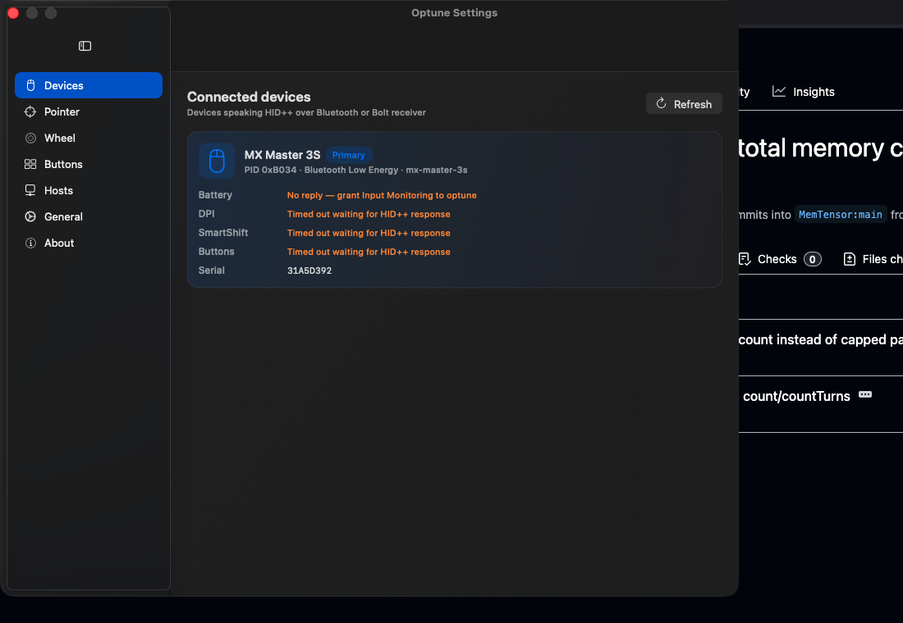

# Optune

A modern, open-source Logitech Options+ replacement — native macOS, written in Swift 6.

> **Status: v0.6.0 — Homebrew tap live, Accessibility (TCC) gate fixed, sidebar Settings, eight HID++ features, per-app profiles, custom button remap, onboard profiles, in-app updates.** Latest release: [v0.6.0](https://github.com/Sanjays2402/optune/releases/latest) (universal DMG, ad-hoc signed) · `brew tap sanjays2402/optune && brew install --cask optune`.



Inspired by [Solaar](https://github.com/pwr-Solaar/Solaar) and [logitune](https://github.com/mmaher88/logitune). Optune is a clean-room Swift implementation for macOS — it doesn't share code with either, but learns from their HID++ work.

## Why

Logitech Options+ is closed-source, ad-laden, runs background "Logi AI" services, and ships a fresh installer every time you blink. If you just want to remap your MX Master 3S buttons and see the battery level, you shouldn't need an account.

Optune is:
- 100% native macOS — Swift 6 + SwiftUI, **Liquid Glass on macOS 26** (looks great on 15 too — same compositions, just slightly less translucent)
- A single signed `OptuneApp.app` plus an `optune` CLI — ~3.8 MB binary, zero dependencies
- IOKit HIDManager for device discovery — no kernel extensions, no daemons, no login items
- GPL-3.0, no telemetry, no account, no ads

## What works in v0.5.0

**HID++ features (read + write)**
- ✅ **UnifiedBattery** (`0x1004`) — live percent, charging state, external power, sparkline history
- ✅ **AdjustableDPI** (`0x2201`) — read range + current, set new value
- ✅ **SmartShift** (`0x2111`) — toggle + sensitivity threshold
- ✅ **ReprogControlsV4** (`0x1B04`) — full button enumeration, runtime remap via `CGEventTap`
- ✅ **HostsInfo** (`0x1815`) — multi-host pairing readout + host switching
- ✅ **OnboardProfiles** (`0x8100`) — host vs onboard mode, active slot picker
- ✅ **Backlight2** (`0x1982`) — keyboard backlight on/off + mode + brightness
- ✅ **FnInversion** (`0x40A3`) — Fn-lock toggle (respects per-keyboard invertible flag)

**Surfaces**
- ✅ Liquid Glass menu bar dropdown with live telemetry pills
- ✅ Sidebar Settings window — 11 panes: Devices · Pointer · Wheel · Buttons · Hosts · Profiles · Keyboard · Onboard · Notifications · Updates · About
- ✅ Per-app profiles: `NSWorkspace` observer flips DPI/SmartShift/wheel when focused app changes
- ✅ macOS notifications: low-battery (with threshold), connection changes, host switches
- ✅ First-run welcome flow + Cmd-Shift-E/I settings export/import (JSON)
- ✅ In-app GitHub Releases poller (no Sparkle SDK)
- ✅ `optune` CLI: `devices`, `doctor`, `battery`, `dpi`, `smartshift`, `buttons`, `hosts`

### Verified devices

MX Master 3S (BLE + USB), MX Master 3, MX Master 4, MX Master 2S, MX Master, MX Anywhere 3S/3/2S, MX Vertical. MX Keys S / MX Keys keyboard families pick up the Backlight + Fn-lock pane. All entries live in [`Sources/OptuneCore/Resources/devices.json`](Sources/OptuneCore/Resources/devices.json) — adding a device is a one-file PR (no Swift changes), see [docs/adding-a-device.md](docs/adding-a-device.md). Per-family DPI bounds and capability flags let the UI hide features the firmware doesn't expose.

## Roadmap

| Milestone | Scope |
|-----------|-------|
| **v0.5** ✅ | Per-app profiles, keyboard backlight + Fn-lock, onboard mode, settings export/import, welcome flow, in-app updates |
| **v0.6** | SmoothScroll (`0x2121`), gesture button virtual events, onboard slot-content writes |
| **v1.0** | Developer-ID signed + notarised, Homebrew cask (`brew install --cask optune`), localized strings |

## Install

**Homebrew (recommended):**

```sh
brew tap sanjays2402/optune
brew install --cask optune
```

The cask is hosted at [`Sanjays2402/homebrew-optune`](https://github.com/Sanjays2402/homebrew-optune) and auto-bumps on every release.

**Manual:** grab the latest DMG from [Releases](https://github.com/Sanjays2402/optune/releases/latest) and drag Optune.app to /Applications. The build is ad-hoc signed (no Apple Developer cert), so first launch needs a right-click → **Open** to bypass Gatekeeper. After that it launches normally.

Optune needs **Input Monitoring** permission to send HID++ feature requests. The welcome flow links you straight to System Settings → Privacy & Security → Input Monitoring on first launch. Button-remap keystroke actions also need **Accessibility** permission (prompted on first use).

## Build from source

Requires macOS 15+ and Swift 6.0+. macOS 26 unlocks the Liquid Glass material; older releases fall back to composited materials that look nearly identical.

```bash
git clone https://github.com/Sanjays2402/optune.git
cd optune
swift build -c release
./.build/release/optune devices
bash Scripts/bundle-app.sh release        # produces .build/OptuneApp.app
open .build/OptuneApp.app
```

Build prerequisites and the `optune doctor` self-test are documented under [docs/](docs/).

## CLI usage

```bash
$ optune battery
MX Master 3S — 78%, discharging (Bluetooth)

$ optune dpi
MX Master 3S — 4000 dpi (range 200…8000)

$ optune dpi 6400
MX Master 3S — applied 6400 dpi

$ optune smartshift
MX Master 3S — SmartShift on, sensitivity 25

$ optune smartshift --off
MX Master 3S — SmartShift disabled

$ optune buttons
MX Master 3S — 8 controls
  [0] 0x0050 Left Click          fixed     pos 1
  [1] 0x0051 Right Click         fixed     pos 2
  [2] 0x0052 Middle Click        reprog    pos 3
  [3] 0x0053 Back                reprog    pos 4
  [4] 0x0056 Forward             reprog    pos 5
  [5] 0x00C4 Smart Shift         reprog    pos 6
  [6] 0x00C3 Gesture Button      reprog    pos 7
  [7] 0x00D7 DPI Switch          reprog    pos 8
```

## Architecture

```
optune/
├── Sources/
│   ├── OptuneCore/     # IOKit HID, HID++ transport, features (0x1004, 0x2201, 0x2111, 0x1B04), DeviceRegistry
│   ├── OptuneUI/       # Shared Liquid Glass design system (typography, materials, primitives)
│   ├── OptuneCLI/      # `optune` command — devices, doctor, battery, dpi, smartshift, buttons
│   ├── OptuneApp/      # SwiftUI menu bar app + sidebar Settings
│   └── OptuneShowcase/ # Standalone hero window for screenshots/marketing (not the production app)
├── Tests/OptuneCoreTests/
└── .github/workflows/ci.yml
```

Five Swift Package products from one `Package.swift`. CLI, app, and showcase all share `OptuneCore` and `OptuneUI`, so a new HID++ feature lights up in every surface.

## Contributing

Issues and PRs welcome. Please run `swift build` and `swift test` before submitting.

If you have a Logitech device that isn't in `Sources/OptuneCore/DeviceRegistry.swift`, the easiest way to help is to:

1. Run `optune devices --json --all` and share the output in an issue
2. Or open a PR adding a `DeviceDescriptor` for it

## License

GPL-3.0-or-later — see [LICENSE](LICENSE). Same as Solaar and logitune so reverse-engineered HID++ knowledge stays in the same family.

## Credits

- HID++ 2.0: reverse-engineered by the Solaar / logiops / libratbag communities over many years
- Inspiration: [logitune](https://github.com/mmaher88/logitune) by mmaher88, [Solaar](https://github.com/pwr-Solaar/Solaar)
- This is a clean-room rewrite for macOS — no code copied
