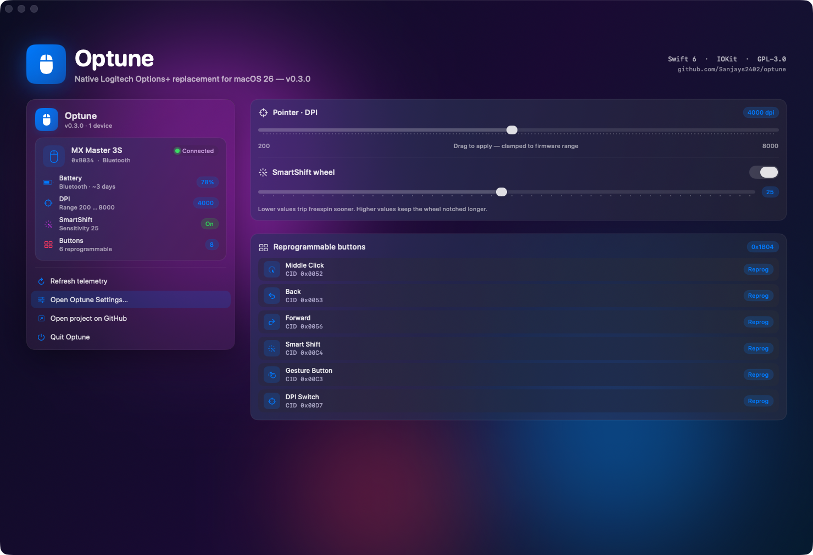

# Optune

A modern, open-source Logitech Options+ replacement — native macOS, written in Swift 6.

> **Status: v0.3.0 — feature complete on the read path.** Battery, DPI, SmartShift, and reprogrammable-button enumeration all run live over HID++ 2.0. Runtime button remap (CGEventTap) lands in v0.4.



Inspired by [Solaar](https://github.com/pwr-Solaar/Solaar) and [logitune](https://github.com/mmaher88/logitune). Optune is a clean-room Swift implementation for macOS — it doesn't share code with either, but learns from their HID++ work.

## Why

Logitech Options+ is closed-source, ad-laden, runs background "Logi AI" services, and ships a fresh installer every time you blink. If you just want to remap your MX Master 3S buttons and see the battery level, you shouldn't need an account.

Optune is:
- 100% native macOS — Swift 6 + SwiftUI, Liquid Glass on macOS 26
- A single signed `OptuneApp.app` plus an `optune` CLI
- IOKit HIDManager for device discovery — no kernel extensions, no daemons, no login items
- GPL-3.0, no telemetry, no account, no ads

## What works in v0.3.0

- ✅ Device enumeration over Bluetooth / Bolt / Unifying
- ✅ HID++ 2.0 transport (short + long reports, sw-id correlation, async send/recv)
- ✅ Feature index lookup via Root (`0x0000`)
- ✅ **UnifiedBattery (`0x1004`)** — live percent, charging state, external power
- ✅ **AdjustableDPI (`0x2201`)** — read range + current, set new value (slider in Settings)
- ✅ **SmartShift (`0x2111`)** — read/write enabled state and sensitivity threshold
- ✅ **ReprogControlsV4 (`0x1B04`)** — enumerates every reprogrammable control with its CID, position, and flags
- ✅ Liquid Glass menu bar dropdown with live telemetry pills
- ✅ Sidebar Settings window with Devices · Pointer · Buttons · About panes
- ✅ `optune` CLI: `devices`, `doctor`, `battery`, `dpi`, `smartshift`, `buttons`

### Verified devices

MX Master 3S (Bluetooth + USB), MX Master 3, MX Master 4, MX Master 2S, MX Master, MX Anywhere 3S/3/2S, MX Vertical. All entries in `Sources/OptuneCore/DeviceRegistry.swift` carry per-family DPI bounds and capability flags so the UI grays out features the firmware doesn't expose.

## Roadmap

| Milestone | Scope |
|-----------|-------|
| **v0.4** | Runtime button remap via `CGEventTap`, gesture button bindings, per-app profiles |
| **v0.5** | Smooth-scroll feature, gestures, MX Keys S keyboard support |
| **v1.0** | Code-signed notarised universal release, Sparkle auto-update, Homebrew cask |

## Install (from source)

Requires macOS 15+ and Swift 6.0+. macOS 26 unlocks the Liquid Glass material; older releases fall back to composited materials that look nearly identical.

```bash
git clone https://github.com/Sanjays2402/optune.git
cd optune
swift build -c release
./.build/release/optune devices
./.build/release/OptuneApp        # menu bar app
```

Optune needs **Input Monitoring** permission to send HID++ feature requests. macOS will prompt the first time you run something that talks to the device. Granted? Re-run `optune doctor` to confirm.

## CLI usage

```bash
$ optune battery
MX Master 3S — 78%, discharging (Bluetooth)

$ optune dpi
MX Master 3S — 4000 dpi (range 200…8000)

$ optune dpi 6400
MX Master 3S — applied 6400 dpi

$ optune smartshift
MX Master 3S — SmartShift on, sensitivity 25

$ optune smartshift --off
MX Master 3S — SmartShift disabled

$ optune buttons
MX Master 3S — 8 controls
  [0] 0x0050 Left Click          fixed     pos 1
  [1] 0x0051 Right Click         fixed     pos 2
  [2] 0x0052 Middle Click        reprog    pos 3
  [3] 0x0053 Back                reprog    pos 4
  [4] 0x0056 Forward             reprog    pos 5
  [5] 0x00C4 Smart Shift         reprog    pos 6
  [6] 0x00C3 Gesture Button      reprog    pos 7
  [7] 0x00D7 DPI Switch          reprog    pos 8
```

## Architecture

```
optune/
├── Sources/
│   ├── OptuneCore/     # IOKit HID, HID++ transport, features (0x1004, 0x2201, 0x2111, 0x1B04), DeviceRegistry
│   ├── OptuneUI/       # Shared Liquid Glass design system (typography, materials, primitives)
│   ├── OptuneCLI/      # `optune` command — devices, doctor, battery, dpi, smartshift, buttons
│   ├── OptuneApp/      # SwiftUI menu bar app + sidebar Settings
│   └── OptuneShowcase/ # Standalone hero window for screenshots/marketing (not the production app)
├── Tests/OptuneCoreTests/
└── .github/workflows/ci.yml
```

Five Swift Package products from one `Package.swift`. CLI, app, and showcase all share `OptuneCore` and `OptuneUI`, so a new HID++ feature lights up in every surface.

## Contributing

Issues and PRs welcome. Please run `swift build` and `swift test` before submitting.

If you have a Logitech device that isn't in `Sources/OptuneCore/DeviceRegistry.swift`, the easiest way to help is to:

1. Run `optune devices --json --all` and share the output in an issue
2. Or open a PR adding a `DeviceDescriptor` for it

## License

GPL-3.0-or-later — see [LICENSE](LICENSE). Same as Solaar and logitune so reverse-engineered HID++ knowledge stays in the same family.

## Credits

- HID++ 2.0: reverse-engineered by the Solaar / logiops / libratbag communities over many years
- Inspiration: [logitune](https://github.com/mmaher88/logitune) by mmaher88, [Solaar](https://github.com/pwr-Solaar/Solaar)
- This is a clean-room rewrite for macOS — no code copied
