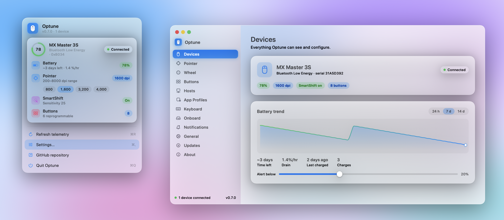
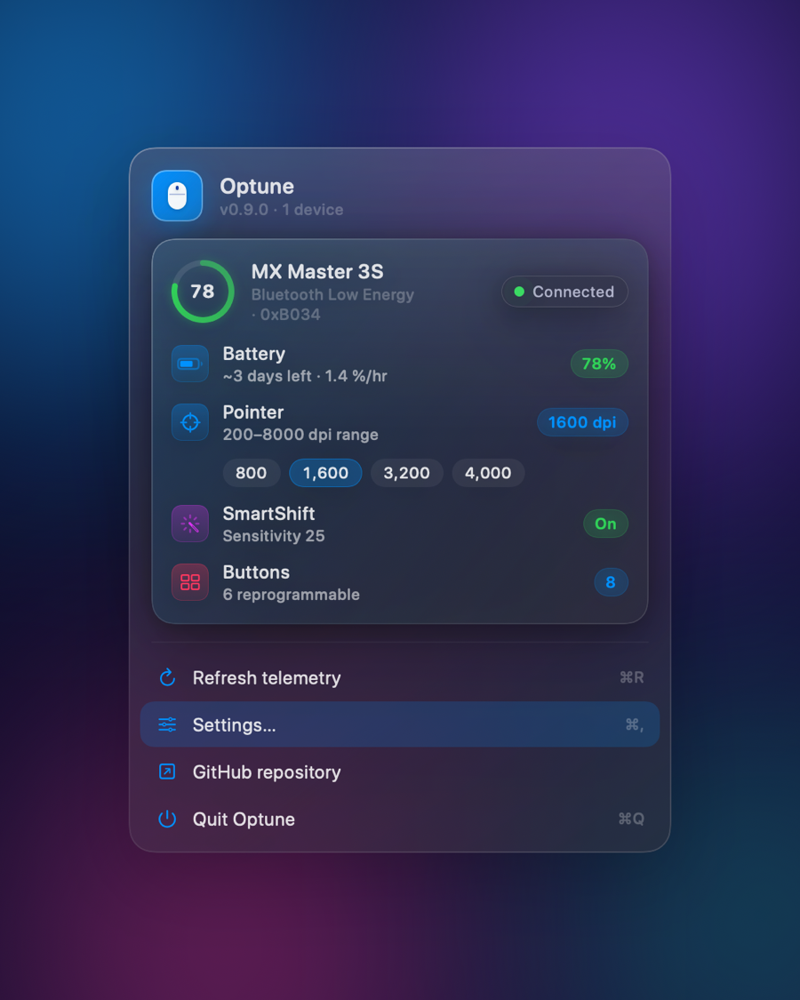
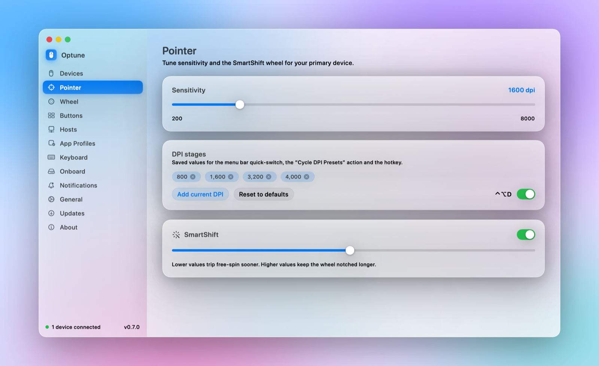
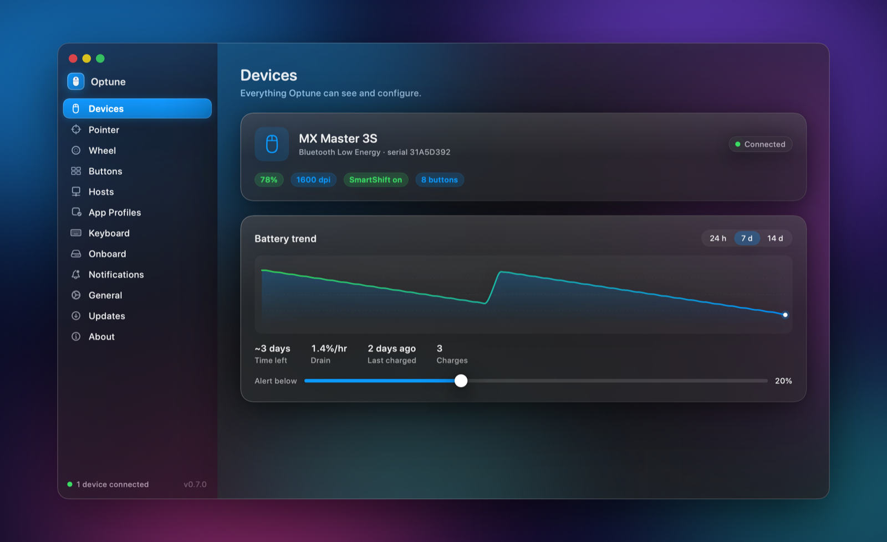
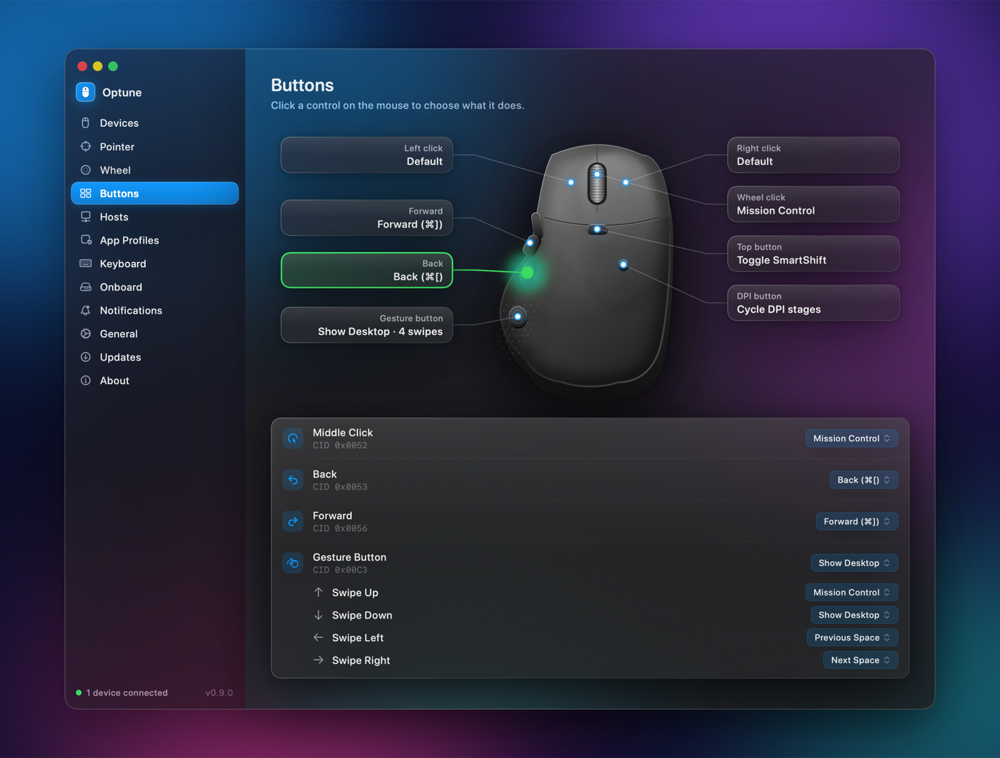

<div align="center">

# Optune

**The open-source Logitech Options+ replacement for macOS.**

Native Swift 6 · SwiftUI Liquid Glass · no accounts, no telemetry, no background daemons.

[**Download for macOS →**](https://github.com/Sanjays2402/optune/releases/latest) · [Install with Homebrew](#install) · [CLI](#cli) · [Changelog](CHANGELOG.md)

<br>

<a href="https://github.com/Sanjays2402/optune/releases/latest">
  
</a>

</div>

<br>

Optune configures Logitech MX mice and keyboards over HID++ — battery, DPI, SmartShift, button remapping, gestures, multi-host switching and keyboard backlight. It ships as one menu bar app plus an `optune` command-line tool, both built on IOKit HIDManager (no kernel extensions).

```sh
brew tap sanjays2402/optune
brew install --cask optune
```

## Highlights

| | |
|---|---|
| 🔋 **Battery insights** | 14 days of history, drain rate, time-remaining estimate, charge count, and a per-device low-battery alert. |
| 🎯 **DPI stages** | Save up to six DPI stages, switch from the menu bar in one click, or cycle with <kbd>⌃</kbd><kbd>⌥</kbd><kbd>D</kbd> from anywhere. |
| 🖐 **Gesture button** | Hold the thumb button and swipe up, down, left or right — each direction runs its own action. |
| 🧭 **Button remapping** | Rebind any reprogrammable control to keystrokes, media keys, mouse clicks, Mission Control, apps, or shell commands. |
| 🪟 **Per-app profiles** | DPI and SmartShift follow the app you're using. |
| 🔀 **Multi-host** | See paired hosts and switch Easy-Switch slots. |
| ⌨️ **Keyboard** | Backlight control and Fn-lock. |
| ✨ **Liquid Glass UI** | Layered glass surfaces and an ambient backdrop; native Liquid Glass on macOS 26. |

## Screenshots

<table>
  <tr>
    <td width="50%"></td>
    <td width="50%"></td>
  </tr>
  <tr>
    <td align="center"><sub><b>Menu bar</b> — live telemetry and one-click DPI stages</sub></td>
    <td align="center"><sub><b>Pointer</b> — sensitivity, saved stages, hotkey, SmartShift</sub></td>
  </tr>
  <tr>
    <td width="50%"></td>
    <td width="50%"></td>
  </tr>
  <tr>
    <td align="center"><sub><b>Battery</b> — trend, drain rate and time remaining</sub></td>
    <td align="center"><sub><b>Buttons</b> — remaps and gesture swipes</sub></td>
  </tr>
</table>

## Install

**Homebrew (recommended)**

```sh
brew tap sanjays2402/optune
brew install --cask optune
```

**Manual** — download the DMG from [Releases](https://github.com/Sanjays2402/optune/releases/latest) and drag **Optune.app** to `/Applications`. The build is ad-hoc signed, so the first launch needs right-click → **Open** to get past Gatekeeper.

### Requirements

- macOS 15 or later (macOS 26 adds native Liquid Glass surfaces).
- **Input Monitoring** permission to talk HID++ to your device, and **Accessibility** permission for remap actions that synthesize keystrokes. Optune asks for each the first time it needs it.

## Features in depth

### Battery insights
Optune samples your battery in the background and keeps 14 days of history. From the current discharge it estimates the **drain rate** and **time remaining**, and shows when you last charged and how many charge sessions you've had. Pick a 24 h / 7 d / 14 d window for the trend chart, and set a **per-device alert threshold** that overrides the app-wide default.

### DPI stages
Define the DPI values you actually use. Stages snap to what your device accepts. They appear as chips in the menu bar, drive the **Cycle DPI Presets** button action, and can be stepped through with the optional global hotkey <kbd>⌃</kbd><kbd>⌥</kbd><kbd>D</kbd> (no extra permission required).

### Gestures
Gesture-capable controls (the MX Master thumb button and friends) support **hold-and-swipe**. Assign an action to each of the four directions in **Buttons**; a plain press still fires the button's own action.

### Buttons & actions
A categorized action picker covers keystrokes, media keys, system shortcuts (Mission Control, App Exposé, Show Desktop, Launchpad), mouse clicks, opening an app, running a shell command, and device modes (cycle DPI, toggle SmartShift, switch scroll mode).

## CLI

```sh
$ optune battery
MX Master 3S — 78%, discharging (Bluetooth)

$ optune dpi 6400
MX Master 3S — applied 6400 dpi

$ optune smartshift --off
MX Master 3S — SmartShift disabled
```

`devices`, `doctor` (discovery & diagnostics) · `battery`, `fw` (status) · `dpi`, `speed`, `smartshift`, `wheel`, `thumbwheel` (pointer & scroll) · `buttons`, `name`, `host` (multi-host), `profile` (onboard), `reset` (device) · `monitor`, `export` (data). Run `optune <command> --help` for flags; most commands accept `--json` for scripting.

## Build from source

Requires macOS 15+ and Swift 6.0+ (Xcode 26 for native Liquid Glass).

```sh
git clone https://github.com/Sanjays2402/optune.git
cd optune
swift build -c release
swift test
bash Scripts/bundle-app.sh release   # → .build/OptuneApp.app
```

Regenerate the README screenshots with the **Screenshots** workflow (`.github/workflows/screenshots.yml`), or locally with `bash Scripts/bundle-showcase.sh` and `OptuneShowcase --scene hero --dark --out hero.png`.

## Architecture

One `Package.swift`, five products sharing a common core:

- `OptuneCore` — IOKit HID, HID++ transport, features, battery & gesture logic, device registry
- `OptuneUI` — shared glass design system
- `OptuneCLI` — the `optune` command
- `OptuneApp` — SwiftUI menu bar app and settings
- `OptuneShowcase` — screenshot/marketing renderer (not the production app)

A HID++ feature added to `OptuneCore` is available in every surface.

## Contributing

Issues and PRs are welcome — run `swift build` and `swift test` first. Adding a device is a one-file change to [`devices.json`](Sources/OptuneCore/Resources/devices.json) with no Swift edits; see [docs/adding-a-device.md](docs/adding-a-device.md). To report an unsupported device, run `optune devices --json --all` and open an issue with the output.

## Credits & license

Inspired by [Solaar](https://github.com/pwr-Solaar/Solaar) and [logitune](https://github.com/mmaher88/logitune); a clean-room implementation that shares no code with either. HID++ 2.0 was reverse-engineered by the Solaar, logiops and libratbag communities.

GPL-3.0-or-later — see [LICENSE](LICENSE).
